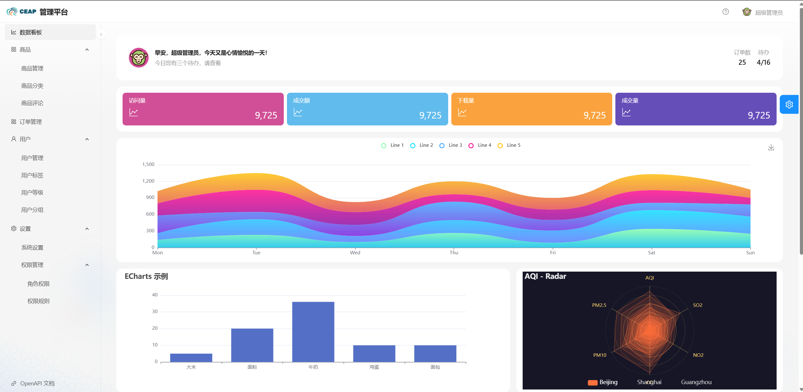

# CEAP

Client Enagement Analytics Portal,客户参与数据分析的平台

# 技术栈

## 后端

spring cloud gateway
spring cloud security
spring boot3
java17
Nacos
Dubbo

## 前端

antd pro

react

echarts 图表

# 项目结构

ceap: java后端项目
admin: 管理平台（PC端）
app: 小程序（手机端）

# 实现功能

1. 管理员账号的查询、修改密码、添加、更新、停用
2. 权限规则的查看
3. 角色的查看、添加、添加权限、删除权限、修改角色名称
4. 附件管理，附件上传，根据标签筛选附件，查询附件
5. 添加商品，商品移入移出回收站，商品上架与下架

# 示例

# 头脑风暴(功能清单)

## 权限管理

精细到按钮级别

## 通用设置

- 系统设置

- 消息通知

## 电商平台

电商看板：展示电商相关数据

商品：
    - 商品管理
    - 商品分类
    - 商品规格
    - 商品评论

订单
    - 订单管理

用户
    - 用户管理
    - 用户标签
    - 用户等级
    - 用户分组

## 人事管理

人事看板：展示员工信息的相关数据

## 附件管理

1. 根据tag查询对应标签的附件
2. 根据名字模糊查询对应附件

